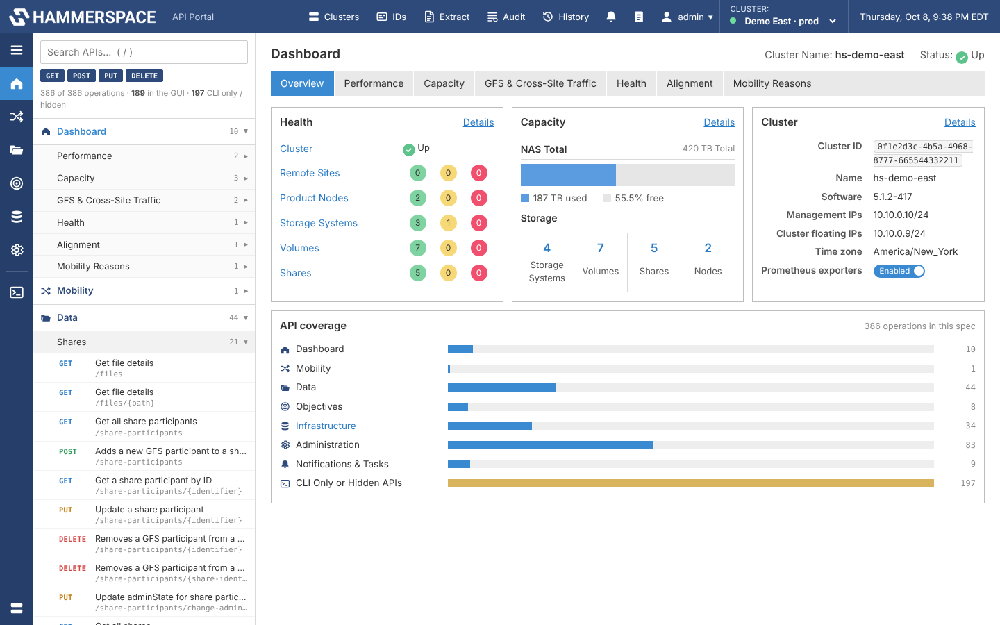
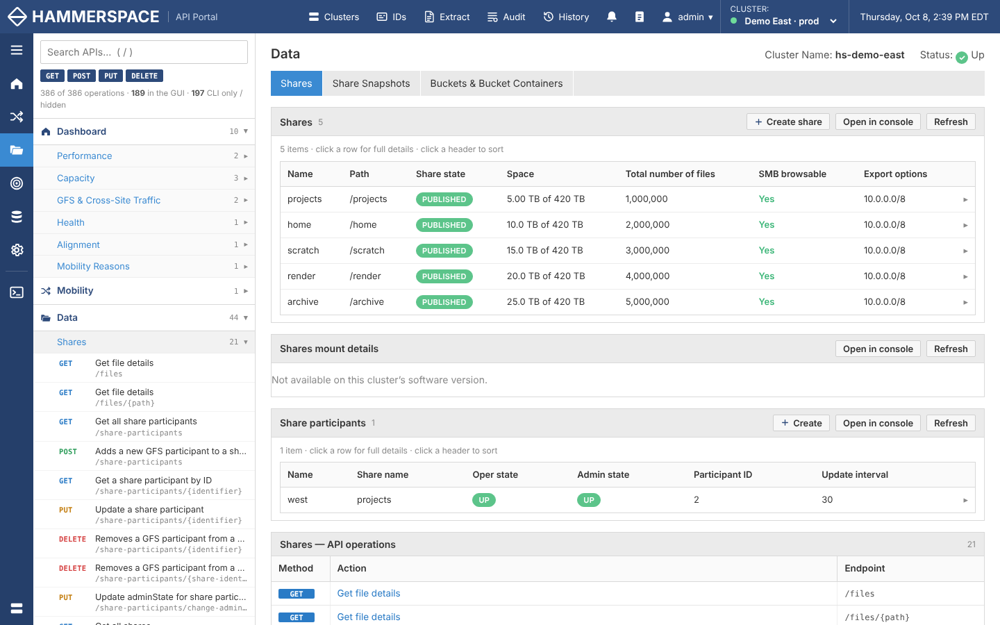
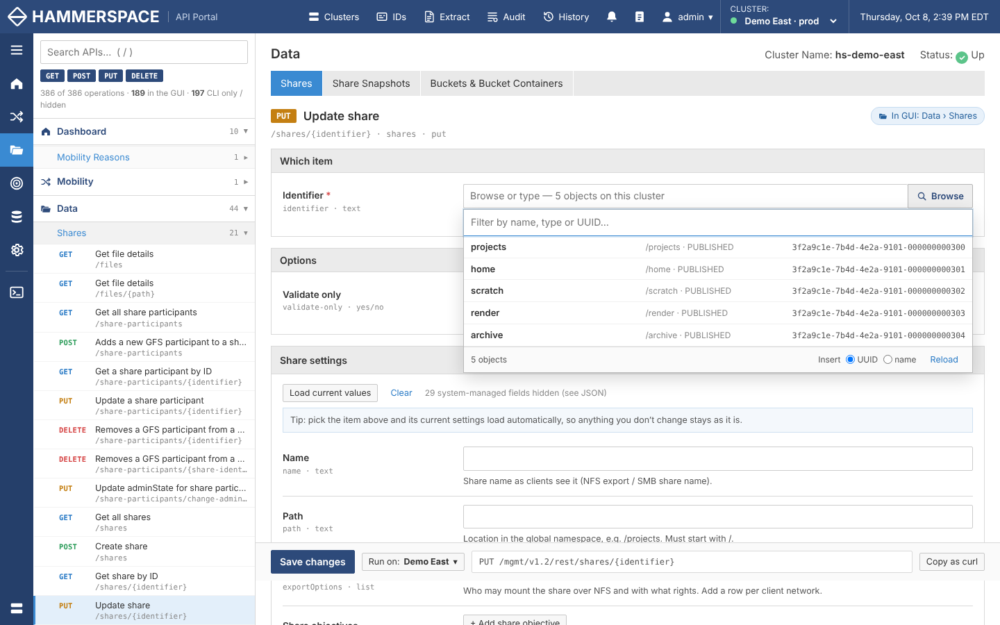
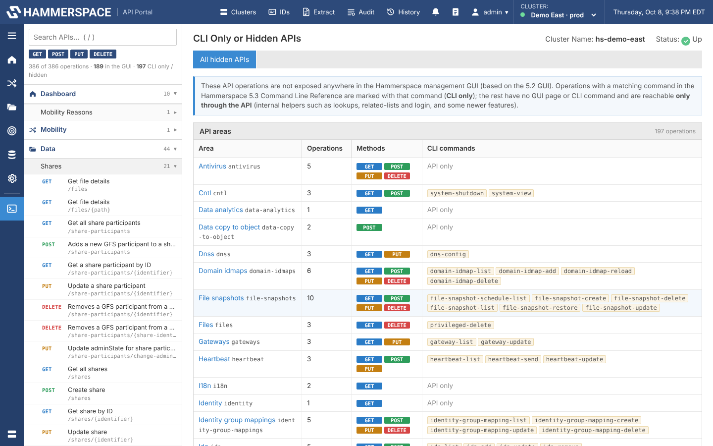
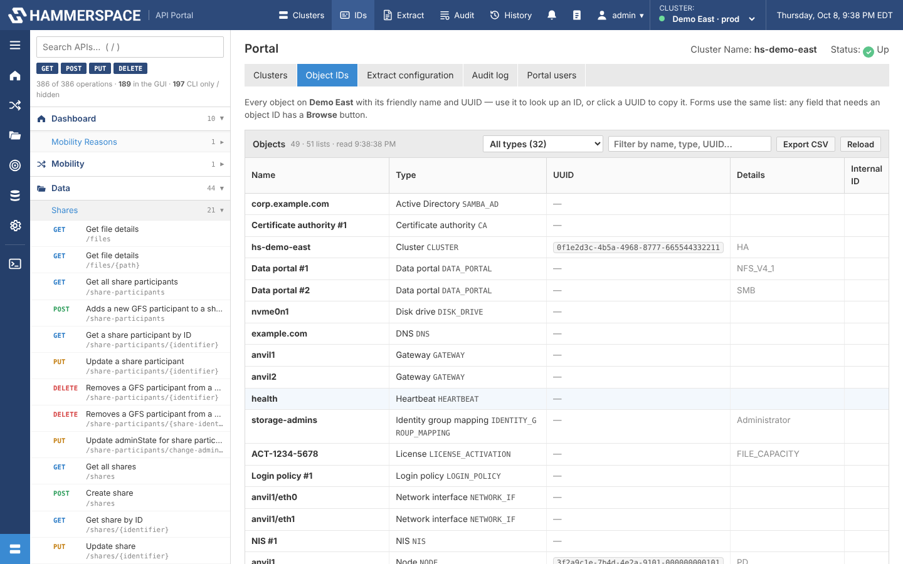

# Hammerspace API Portal

A self-hosted web console for the Hammerspace management API, covering **every** operation in the API, including the ones the standard GUI doesn't expose. It manages several clusters from one place, uses friendly forms instead of raw JSON, can push changes to many clusters at once, and extracts configuration reports.

> **Unofficial community project.** Hammerspace, Inc. does not make, endorse or support it. "Hammerspace" is used only to describe compatibility. Test changes on a non-production cluster first.



## Contents

- [Features](#features)
- [Screenshots](#screenshots)
- [Quick start](#quick-start)
- [Configuration](#configuration)
- [Using the portal](#using-the-portal)
- [Security](#security)
- [Customising](#customising)
- [Project layout](#project-layout)
- [Development](#development)
- [Limitations](#limitations)
- [License](#license)

## Features

- **All 386 API operations** (268 paths) are generated from the cluster's `swagger.json` (sys-mgmt API v1.2). Drop in a newer spec and new endpoints appear without code changes.
- **Laid out like the Hammerspace GUI.** Operations are organised by GUI section and tab (Dashboard, Data › Shares, Administration › Network, …). Each tab shows live data from the cluster.
- **"CLI Only or Hidden APIs".** The operations the GUI doesn't expose (DNS, NTP, LDAP, KMS, roles, syslog, SMTP, antivirus, file snapshots, internal lookups…) are listed separately, grouped by area.
- **Forms, not JSON.** Every request body and parameter is a form field with a label and a plain-English description. It includes dropdowns, yes/no toggles, size units, lists, and nested groups. A JSON tab is still there.
- **Object picker (name ↔ UUID).** Every field that needs an object ID has a **Browse** button listing the cluster's objects by friendly name with their UUIDs. An **Object IDs** page lists them all, and you can export it to CSV.
- **Multi-cluster.** Register any number of clusters and switch between them. You can **push a change to several clusters at once**: edits apply only the fields you changed, and object IDs are matched by name on each cluster.
- **Formatted output.** Responses appear as sortable tables, status pills, readable sizes and dates, and expandable details, with the raw JSON one click away.
- **Configuration extraction.** A read-only sweep of a cluster's configuration produces a self-contained HTML report (printable to PDF) plus raw JSON. It can be uploaded to Hammerspace professional services as a `.tar.gz` bundle.
- **Accounts and audit.** Portal users sign in to the portal. Cluster credentials are stored encrypted on the server, and every change is written to an audit log.
- **Zero dependencies.** Plain Node.js (no `npm install`) and a small Docker image.

## Screenshots

| GUI-style tab with live data | Object picker |
|---|---|
|  |  |
| **CLI Only or Hidden APIs** | **Object IDs** |
|  |  |

*(Screenshots use simulated demo clusters.)*

## Quick start

### Docker Compose (recommended)

```bash
git clone https://github.com/<you>/hammerspace-api-portal.git
cd hammerspace-api-portal
docker compose up -d --build
```

Open <http://localhost:8080>. On first start you create the **portal admin** account. Then add your clusters under **Clusters → + Add Cluster**; you'll need each cluster's management URL (e.g. `https://anvil.example.com:8443`) and an admin account.

### Docker

```bash
docker build -t hs-api-portal .
docker run -d --name hs-api-portal -p 8080:8080 -v hs-portal-data:/data hs-api-portal
```

### Without Docker

You need Node.js 18 or newer (22 recommended).

```bash
node server.js            # or: npm start
```

Portal data is written to `./data`.

> **Keep `/data` on a persistent volume and back it up.** It holds portal users, the cluster registry, the encryption key (`secret.key`) and the audit log. Without the key (or your `PORTAL_SECRET_KEY`), stored cluster passwords can't be decrypted.

## Configuration

All settings are environment variables. See `docker-compose.yml` for a commented example.

| Variable | Default | Purpose |
|---|---|---|
| `PORT` | `8080` | Listen port |
| `DATA_DIR` | `/data` (container), `./data` (local) | Where portal state is stored |
| `PORTAL_ADMIN_USER` / `PORTAL_ADMIN_PASSWORD` | – | Create the first portal admin automatically instead of using the first-run screen |
| `PORTAL_SECRET_KEY` | generated | Key that encrypts stored cluster passwords. If unset, a random key is written to `DATA_DIR/secret.key` |
| `SESSION_TTL_MIN` | `480` | Idle timeout for portal sessions, in minutes |
| `HS_URL` | – | Pre-fills the URL field when adding a cluster |
| `HS_ALLOWED_HOSTS` | – | Comma-separated allowlist of cluster hostnames that may be registered |
| `SPEC_PATH` | `public/swagger.json` | Location of the API spec (or mount a file over `/app/public/swagger.json`) |
| `UPLOAD_ENABLED` | `true` | Show *Upload to Hammerspace* after an extraction |
| `UPLOAD_URL` | `https://v1proto.sc.hammerspace.com/upload/` | Upload endpoint |
| `UPLOAD_INSECURE_TLS` | `true` | Skip TLS verification for the upload (same as `curl --insecure`) |
| `UPLOAD_PAYLOAD` | `prosvcs` | `payload` / `payload_type` form fields |
| `UPLOAD_WORK_DIR` | `/tmp/hs-portal-uploads` | Where bundles are built before upload |
| `UPLOAD_KEEP_BUNDLES` | `false` | Keep bundles after upload instead of deleting them |

### Using a different API version

The bundled `public/swagger.json` is the v1.2 sys-mgmt spec. To match your cluster's software exactly, download the spec from the cluster and replace the file, or mount it:

```bash
docker run ... -v /path/to/swagger.json:/app/public/swagger.json:ro hs-api-portal
```

## Using the portal

### Layout

The portal is laid out like the Hammerspace management GUI:

- A top bar with the cluster switcher, clock and portal tools.
- An icon rail for the GUI sections.
- Gray tab strips and gray-header panels.

The left-hand list mirrors the GUI: **section → tab → API operation**. Opening a tab shows the same data the GUI tab shows, plus every operation that tab uses. Below a divider, **CLI Only or Hidden APIs** lists everything the GUI doesn't expose. Each operation page shows where it lives: *In GUI: Data › Shares* or *CLI only / hidden*.

The mapping is in [`public/nav.js`](public/nav.js) (see [Customising](#customising)).

### Clusters

- **Clusters** lists every registered cluster with its live status: state, software version, node count, capacity and reachability. Each one has *Use*, *Test*, *Edit* and *Remove* buttons.
- When you add a cluster, the portal signs in to it first to check the URL and credentials.
- **Tags** (e.g. `prod`, `dr`, `east`) group clusters for pushes.
- The portal signs in to each cluster itself and re-authenticates when a cluster session expires. Browsers never see cluster credentials or cookies.

### Running operations

- Pick an operation from the list, or search for it (press `/`; type `hidden` or `gui` to narrow the results). Fill in the form and press the button (`Ctrl/⌘ + Enter` also works).
- **On edit screens**, choosing the item loads its current settings. Anything you don't change is sent back unchanged.
- **Delete operations and risky ones** (shutdown, decommission, restore, `force`, …) ask for confirmation.
- **API command panel:** above the submit button, the full request is shown as you fill in the form, wrapped over as many lines as it needs: method, complete URL with the cluster address and query string, headers, and the pretty-printed body. You can switch between **curl** and raw **HTTP** and copy either. Passwords and keys are masked unless you tick *Show secrets*. The session cookie is a placeholder, because the portal signs in for you.
- Other tools: **Copy as curl**, a history of recent requests, and per-operation memory of the last inputs (never passwords).

### Explanations from the Command Line Reference

The portal includes help text from the *Hammerspace 5.3 Command Line Reference* and from the CLI's own built-in help: 213 CLI commands and about 1,200 option descriptions, mapped onto the API.

- **Under each form field and parameter:** the matching CLI option and its documentation (marked **CLI**). For example, `exportOptions` shows `--export-option` with the full client-spec syntax and examples, and `cronExpression` shows `--minute`, `--hour` and the other schedule options. Long entries expand with *more*.
- **On each operation page:** a **Command-line equivalent** card with the CLI command, what it does, its example, and all of its options.
- **In tables:** CLI command names are shown next to each operation, and you can search for them (typing `share-create` finds `POST /shares`).
- **CLI Only or Hidden APIs** separates operations that have a CLI command (*CLI only*) from those reachable *only through the API*. API-only operations carry a **⚠ use with caution** marker and a warning on their page: they're neither in the GUI nor documented in the CLI guide, and may impact cluster operation and stability.

The data is in `public/cli-docs.js`. It is generated by `tools/cli-docs/`; rerun it when a new reference is published.

### Object IDs (name ↔ UUID)

When you select a cluster, the portal reads its object lists in the background: about 50 object types, kept for 5 minutes, with **Reload** to fetch them again.

- **Browse** appears on every field that takes an object: path `{identifier}`/`{uuid}`, `objectUuid`, `shareUuid`, `volumeUuid`, `activation-id`, `node`, `share`, `site`, body fields ending in `Uuid`, and others.
  - It lists each object's name, type, details and UUID.
  - Picking one inserts the UUID. For `identifier` fields, which also accept names, you can switch to inserting the name.
  - The field then confirms which object the value refers to.
- **Type/UUID pairs** fill together. For example, picking a node for `/reports/stats/performance/{objectType}/{objectUuid}` also sets `objectType` to `NODE`.
- The **IDs** page lists every object with a copyable UUID, and you can export it to CSV. Hovering over a UUID in any output shows the object's name.

### Pushing a change to several clusters

Every operation has a **Run on: …** button next to its submit button. Tick clusters, or use the quick picks: *Active only*, *All*, or a tag such as *#prod*.

- **Edits:** for each target cluster, the portal loads *that cluster's* current object and applies **only the fields you changed**.
- **Creates:** the same settings go to every cluster. References to other objects are sent by name.
- **Object IDs** chosen with Browse are matched **by name** on each cluster and replaced with that cluster's own UUID.
- **How it runs:** clusters run 4 at a time, and a results table shows each one's outcome. A cluster that fails doesn't stop the others. All calls in one push share a batch ID in the audit log.

### Extracting a configuration report

**Extract** reads every configuration area of the selected clusters using read-only `GET` requests. It produces one report per cluster.

- The report has summary tiles, a table of contents, a table per area, and expandable details. Empty areas, areas the cluster's software version doesn't have, and areas that couldn't be read are listed in an appendix.
- Secrets (passwords, keys, credentials) are **redacted by default**.
- Downloads: the HTML report, raw JSON, or a bundle (`.tar.gz`).
- **Upload to Hammerspace** sends the bundle the same way the support script's `curl` does:
  - The file is named `hs_config_bundle_<cluster>_<clusterId>_<YYYYMMDD>_<epoch>.tar.gz`.
  - `cluster_id` is the cluster's real UUID.
  - You confirm every upload, and every upload is logged.

### Portal users and audit log

- **Portal users** (under your name ▾) lists the accounts. Every portal user can use every registered cluster.
- The **Audit** page shows every change: all non-read API calls, cluster and user changes, and uploads, each with the user, cluster, request, result and batch ID. You can download it. It's stored as JSON lines in `DATA_DIR/audit.log`.

## Security

- **Portal accounts:** passwords are hashed with scrypt, and 5 failed sign-ins lock that IP address out for 5 minutes. Sessions use `HttpOnly`, `SameSite=Strict` cookies, and state-changing requests require a custom header.
- **Stored cluster credentials:** encrypted with AES-256-GCM. The API never returns them to the browser.
- **Permissions:** every portal user has full admin reach to every registered cluster.
  - Run the portal on a trusted management network.
  - Put it behind a TLS reverse proxy (nginx, Traefik, Caddy…) if it's reachable beyond localhost.
  - Use strong passwords.
  - Consider setting `HS_ALLOWED_HOSTS`.
- **TLS to clusters:** certificate checks are skipped by default because clusters usually have self-signed certificates. Untick *Accept the cluster’s self-signed certificate* on a cluster if yours have trusted certificates.
- **Never commit** the `data/` directory or a `PORTAL_SECRET_KEY`. `.gitignore` already excludes `data/`.

## Customising

| File | What to change |
|---|---|
| [`public/nav.js`](public/nav.js) | Which GUI section/tab each API belongs to; `HIDDEN` (operations listed under *CLI Only or Hidden APIs*); and `NOT_IN_GUI` (optional: operations grouped in a section but flagged as not in the GUI; empty by default). Rules are `[METHOD, /path regex/]` and the first match wins. |
| [`tools/cli-docs/`](tools/cli-docs/) | Regenerates `public/cli-docs.js` (CLI command and option help) from a new Command Line Reference PDF. `map.py` maps CLI commands to API operations. |
| [`public/meta.js`](public/meta.js) | Field descriptions, which fields are system-managed or advanced, and which list feeds each reference dropdown. |
| [`public/objects.js`](public/objects.js) | The object types loaded into the name ↔ UUID directory. |
| [`public/app.js`](public/app.js) → `ID_PARAMS` | Which parameters get the object picker, and whether it inserts a UUID or a name. |
| [`public/extract.js`](public/extract.js) | Chapters, sections and columns of the configuration report. |
| [`public/styles.css`](public/styles.css) | Colours and layout (CSS variables at the top). |

## Project layout

```
├── server.js            HTTP server: static files, portal API, per-cluster proxy (/c/<id>/hs/*)
├── store.js             Portal users, cluster registry (encrypted credentials), audit log
├── upload.js            Builds .tar.gz bundles and uploads them (multipart POST)
├── public/
│   ├── index.html       App shell
│   ├── swagger.json     Hammerspace sys-mgmt API spec (v1.2)
│   ├── app.js           Operation pages, sending, multi-cluster pushes, extraction UI
│   ├── shell.js         GUI-style navigation, tab pages, dashboard
│   ├── nav.js           API → GUI section/tab mapping, hidden list, icons
│   ├── objects.js       Name ↔ UUID directory, object picker, Object IDs page
│   ├── forms.js         Form generator for request bodies
│   ├── meta.js          Field descriptions and hints
│   ├── cli.js           CLI help shown under fields and on operation pages
│   ├── cli-docs.js      Generated from the Command Line Reference (tools/cli-docs)
│   ├── render.js        Formatted response rendering
│   ├── extract.js       Configuration extraction and report builder
│   ├── clusters.js      Clusters, users and audit pages, cluster switcher
│   └── styles.css
├── docs/screenshots/
├── Dockerfile
└── docker-compose.yml
```

There's no build step: the browser loads the files as they are.

## Development

```bash
node server.js                      # http://localhost:8080, data in ./data
PORT=9000 DATA_DIR=/tmp/hsdata node server.js
```

- Edit the files in `public/` and reload the browser.
- Server changes need a restart.
- Health check: `GET /healthz`.

## Limitations

- **URL encoding:** path parameters are URL-encoded, so `a/b` in `/files/{path}` is sent as `a%2Fb`. Use the query-parameter variant (`GET /files?path=`) if your cluster expects literal slashes.
- **Clearing fields in pushes:** clearing a field isn't pushed as a change in multi-cluster edits. Use the JSON tab to remove a value on many clusters.
- **Typed UUIDs in pushes:** UUIDs typed into a request body by hand (JSON tab, or body fields ending in `Uuid`) aren't translated between clusters. Pick objects in parameter fields, or use names.
- **GUI mapping:** which APIs count as "in the GUI" is based on the 5.2 management GUI. Adjust `public/nav.js` for other versions.

## License

No license has been chosen yet. Add a `LICENSE` file (for example MIT or Apache-2.0) before publishing publicly. Until then, all rights are reserved by the author.

The bundled `swagger.json` and the option descriptions in `public/cli-docs.js` (taken from the *Hammerspace Command Line Reference*) are Hammerspace, Inc. material. Check that you may redistribute them before publishing this repository publicly. The same applies to the Hammerspace logo in `public/img/hammerspace-logo.png`, which is a Hammerspace trademark. For a public, unofficial repository, consider replacing it with a plain text title.
